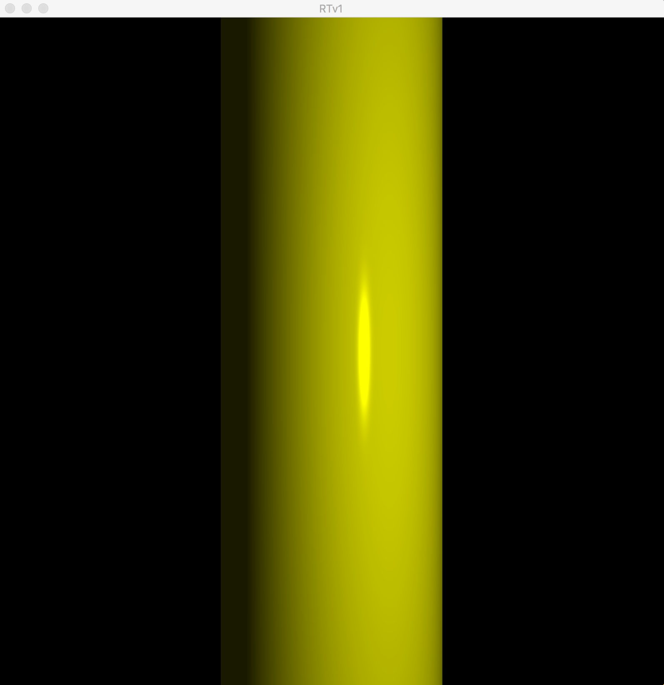
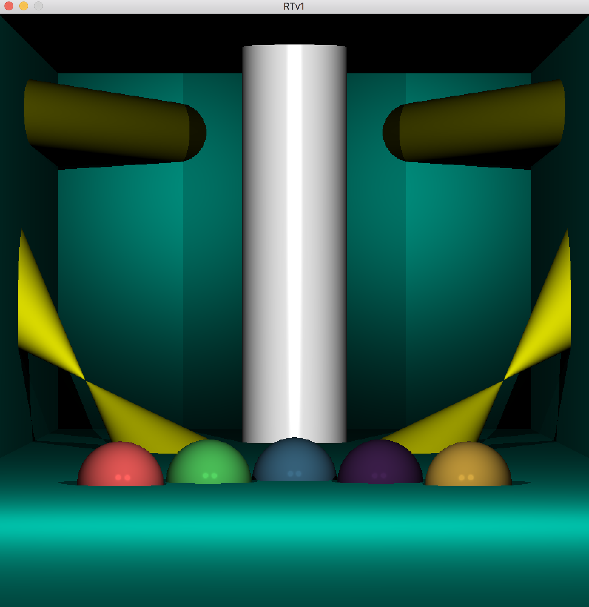
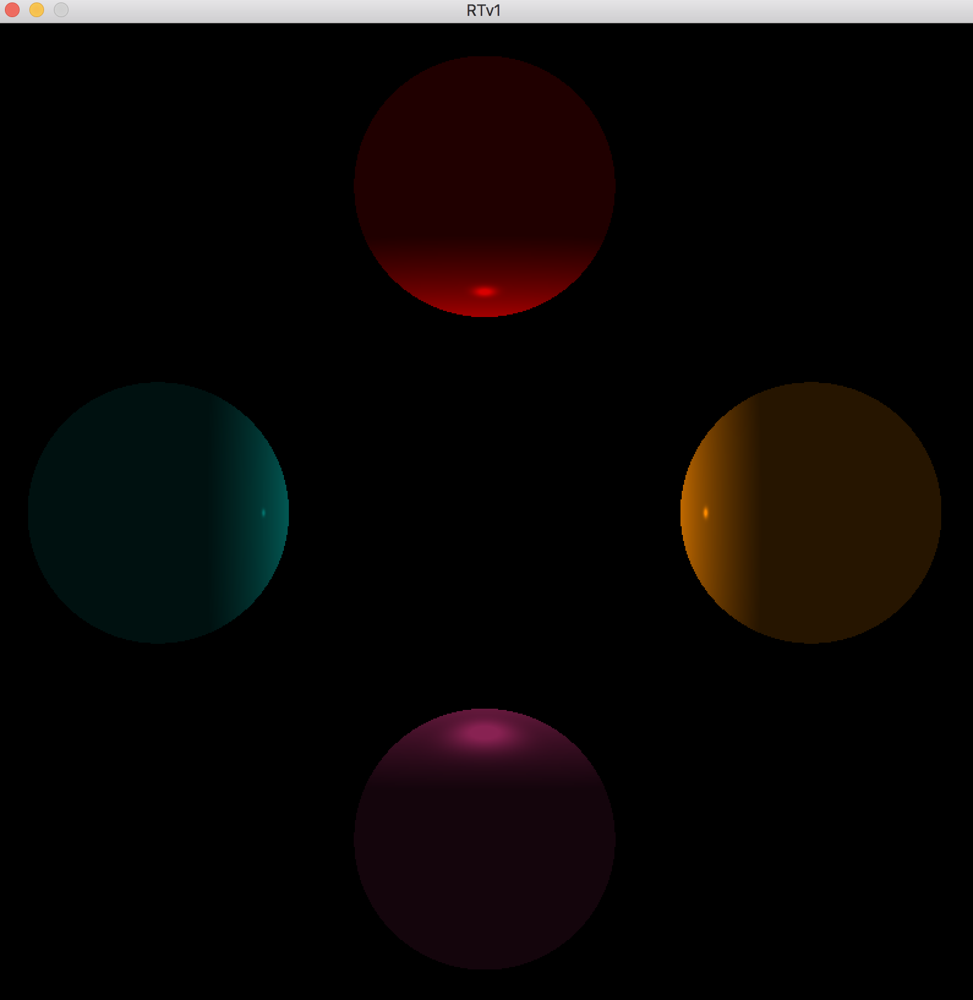
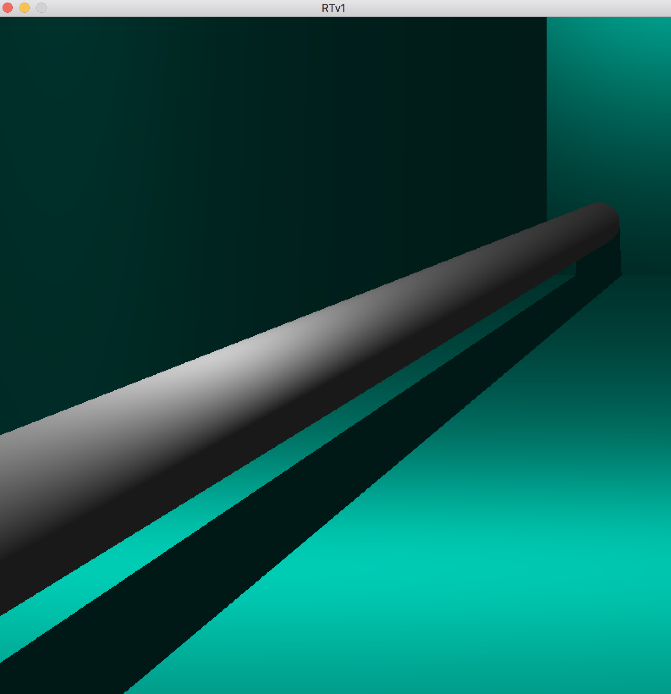
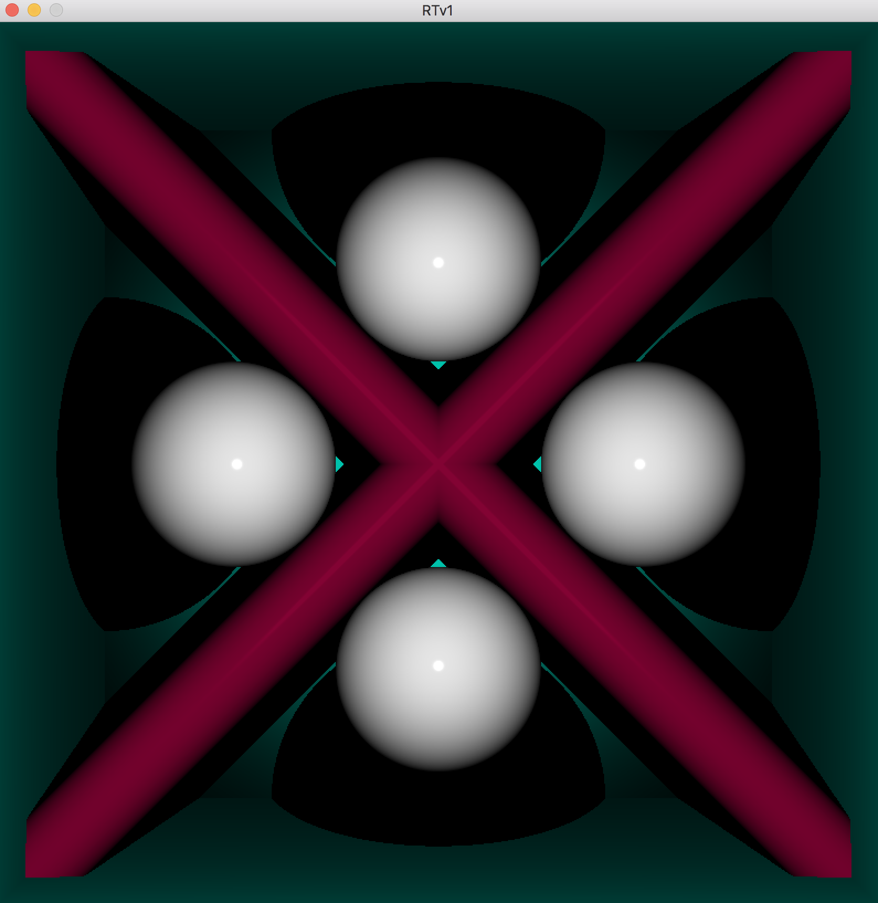

# RTv1
It's my own simple ray tracer. It parses a 3D scene from a file and applies ray tracing algorithm to render the given scene.

<h2>Several options:</h2>

- Four types objects: plane, sphere, cylinder, cone.

- rotation and translation camera and objects.

- light managment.
<h2>Install & launch:</h2>

-git clone https://github.com/pavelrosh/RTv1.git ~RTv1

-cd RTv1

-make

-put a parameter to binary file like "./RTv1 scene/sphere"
